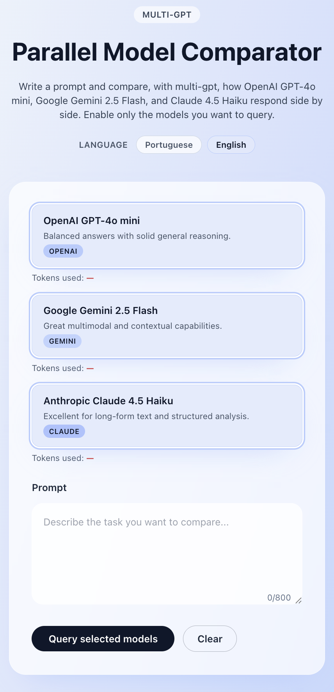

# Multi-GPT

Multi-GPT lets you ask a single question and instantly compare responses from OpenAI (ChatGPT), Google Gemini, and Anthropic Claude. The repository contains both the NestJS backend that fans out the requests and the React frontend that renders every answer side by side.

## Repository layout

- `backend/` – NestJS service that validates prompts, forwards them to the selected providers in parallel, normalizes the payloads, and returns a unified response with token usage metadata.
- `frontend/` – Vite + React + Tailwind interface that talks to the backend, visualizes every model response, tracks token consumption, and supports English/Portuguese localization.

Each folder has a detailed README with setup instructions, environment variables, and extra context.

## Screenshots

| Desktop layout | Mobile layout |
| --- | --- |
|  |  |

## Getting started (quick view)

1. Install dependencies in both folders (`npm install`).
2. Configure API keys in `backend/.env` and point the frontend to the backend via `VITE_API_BASE_URL`.
3. Run the backend (`npm run start:dev` in `backend/`) and the frontend (`npm run dev` in `frontend/`), then open the UI at `http://localhost:5173`.

With that, you have a side-by-side playground for today’s leading conversational models—perfect for demos, workshops, and prompt crafting sessions. See each directory’s README for deeper documentation.
